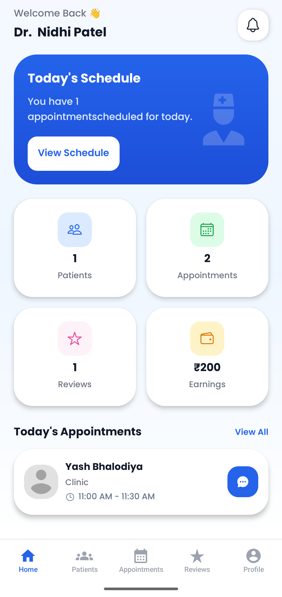
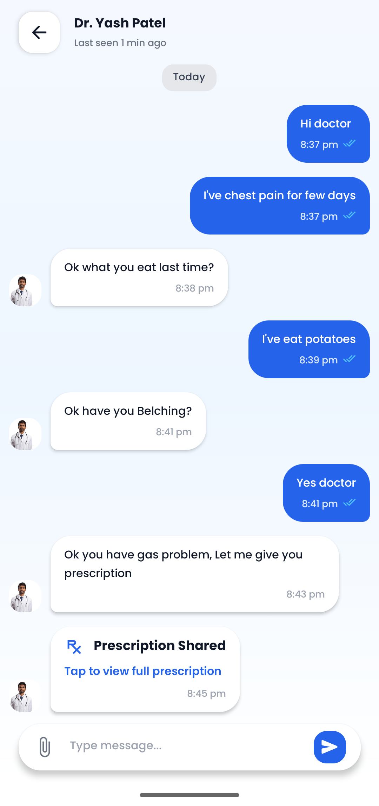
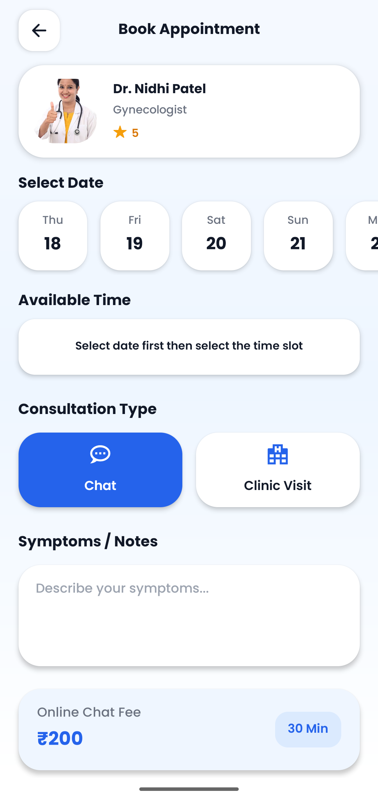
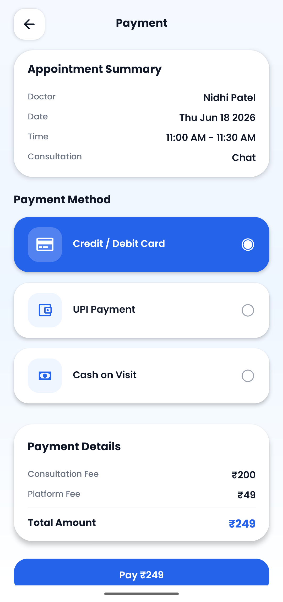
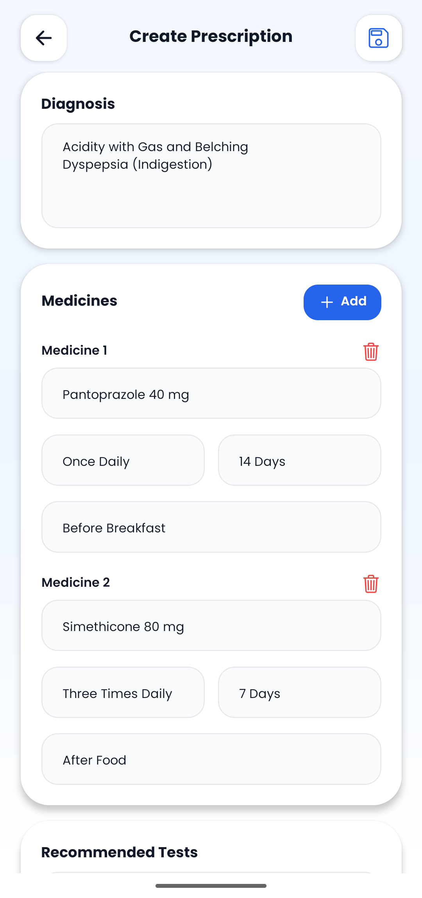

# 🏥 Medora Healthcare App

Medora is a modern healthcare platform that connects patients and doctors for seamless online appointment booking, consultations, payments, prescription builder and notifications.

---

## ✨ Features

### 👨‍⚕️ Doctor Side
- Profile management
- Appointment management
- Earnings & transaction dashboard
- Prescription builder
- Patient reviews & ratings
- Availability scheduling

### 🧑‍⚕️ Patient Side
- Find doctors by specialization
- Book appointments
- Online payments
- View appointment history
- Notifications system

---

## High-Level System Architecture

                         ┌──────────────────────────┐
                         │      MEDORA MOBILE APP   │
                         │      React Native        │
                         └────────────┬─────────────┘
                                      │
                    ┌─────────────────┴─────────────────┐
                    │                                   │
             ┌──────▼──────┐                     ┌──────▼──────┐
             │   PATIENT   │                     │   DOCTOR    │
             │     APP     │                     │     APP     │
             └──────┬──────┘                     └──────┬──────┘
                    │                                   │
                    └─────────────────┬─────────────────┘
                                      │
                              ┌───────▼────────┐
                              │    SERVICES    │
                              │                │
                              │ Authentication │
                              │ Appointments   │
                              │ Payments       │
                              │ Prescriptions  │
                              │ Notifications  │
                              │ File Uploads   │
                              └───────┬────────┘
                                      │
                 ┌────────────────────┼────────────────────┐
                 │                    │                    │
          ┌──────▼──────┐      ┌──────▼──────┐      ┌──────▼──────┐
          │   Firebase  │      │  Firestore  │      │   Storage   │
          │    Auth     │      │  Database   │      │   Files     │
          └─────────────┘      └─────────────┘      └─────────────┘
                                      │
                               ┌──────▼──────┐
                               │     FCM     │
                               │ Push        │
                               │ Notifications│
                               └─────────────┘

---

## 📱 Screens Included

- Login / Signup
- Home Dashboard
- Find Doctors
- Doctor Profile
- Appointment Booking
- Appointment Details
- Payment Screen
- Prescription Builder
- Notifications Screen
- Reviews & Ratings
- Earnings Dashboard (Doctor)

---

## 🛠 Tech Stack

- React Native / Android
- Firebase
- Redux / Context API

---

## 🚀 Getting Started

```bash
git clone https://github.com/your-username/medora-healthcare-app.git
cd medora-healthcare-app
npm install
npx react-native run-android
```

---

## Screenshots

## Patient Home


## Doctor Home


## Chat & Prescription


## Appointment Booking


## Payment


## Prescription Builder

